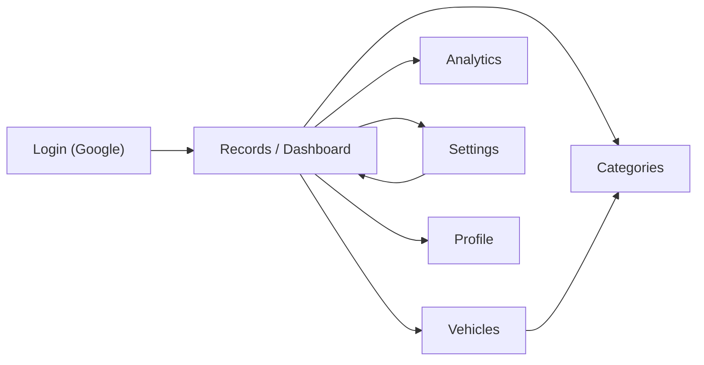
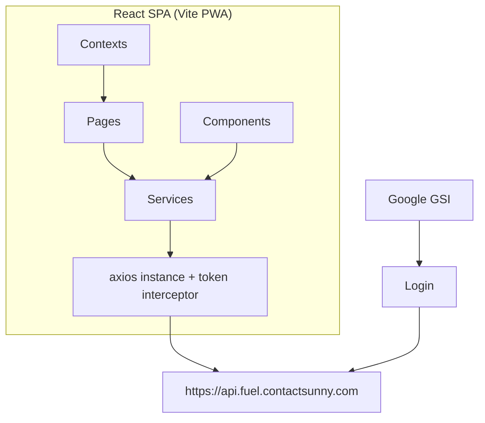

# 01 — Overview

Related: [Folder structure](./02-folder-structure.md) · [Routing](./03-routing.md) · [API](./05-api.md) · [Dependencies](./14-dependencies.md) · [AI context](./18-ai-context.md)

## What this application does

**Fuel Expenses** is a Progressive Web App (PWA) for tracking personal vehicle fuel spend, vehicles, vehicle categories, and fuel-related analytics. Users sign in with Google, log fuel fill-ups (amount, litres, fuel type, payment method), manage their vehicle fleet, set defaults, and view charts of spending.

## Primary purpose

- Record and review fuel expenses in INR
- Associate each fill-up with a vehicle and category
- Analyze spend by vehicle category, fuel price over time, and fuel type
- Work as an installable mobile/desktop PWA

## Target users

Individual vehicle owners (personal use). There is no multi-tenant admin UI, no role system, and no team/organization features in the frontend. One authenticated user sees and mutates only their own data via the backend token.

## Major workflows

1. **Sign in** — Google Identity Services → backend `/user/login` → store `token` + `user` in `localStorage` → redirect to Records.
2. **Manage categories** — Create/edit/delete vehicle categories (e.g. Personal, Work).
3. **Manage vehicles** — Create/edit/delete vehicles, optionally linked to a category and registration number.
4. **Log fuel** — FAB on Records opens modal form; create or edit fuel records; client-side pagination and filters.
5. **Defaults** — Settings page saves default vehicle / fuel type / payment type; applied when creating new fuel records.
6. **Analytics** — Three chart views for the last 6 months (hardcoded range).
7. **Logout** — Clears all `localStorage` and returns to Login (API logout endpoint is defined but not called).

## High-level architecture

- **SPA** — React 19 + TypeScript + React Router 7
- **API client** — Single axios instance in [`src/services/api.ts`](../src/services/api.ts) attaches `token` header from `localStorage`
- **UI** — Tailwind CSS v4 utility classes; dark mode via `ThemeContext` + `.dark` class on `<html>`
- **State** — React Context for theme and fuel-record modal coordination; everything else is local component state
- **Backend** — External REST API (not in this repo): `https://api.fuel.contactsunny.com`

This repository contains **only the frontend**. Backend contracts are inferred from how the client calls and parses responses.

## Tech stack

| Layer | Technology |
|-------|------------|
| UI | React 19.1, TypeScript ~5.9 |
| Routing | react-router-dom 7 |
| HTTP | axios 1.13 |
| Charts | recharts 3 |
| Styling | Tailwind CSS 4 + PostCSS |
| Bundler | Vite 7 |
| PWA | vite-plugin-pwa (injectManifest) + custom `sw.ts` |
| Auth UI | Google Identity Services (script load) |

Not used: Redux, Zustand, MobX, React Query / TanStack Query, CSS modules, form libraries (react-hook-form, etc.).

## Build tools

| Script | Command | Purpose |
|--------|---------|---------|
| Dev | `npm run dev` | Vite dev server |
| Build | `npm run build` | `tsc -b` then `vite build` |
| Lint | `npm run lint` | ESLint |
| Preview | `npm run preview` | Preview production build |
| Icons | `npm run generate-icons` | Generate PWA PNGs from `public/favicon.svg` via sharp |

## Deployment assumptions

- Static hosting of Vite `dist/` output (any static host / CDN)
- Client talks **directly** to the production API URL hardcoded in source (`api.fuel.contactsunny.com`) — no Vite proxy or `.env` API URL in the repo
- Google OAuth Client ID is **hardcoded** in Login; redirect / authorized origins must be configured in Google Cloud Console for the deployed origin
- PWA service worker expects HTTPS in production (standard browser requirement)
- No SSR; all routing is client-side (`BrowserRouter`)

## Currency and locale assumptions

- Money is formatted as **INR** (`Intl.NumberFormat` with `currency: 'INR'`)
- Date display varies by page (`en-GB` in some places, browser locale in others)

## Incomplete / stub features

Documented as-is from code:

- **Service Records** page is a placeholder UI; full CRUD API helpers exist in [`src/services/serviceRecords.ts`](../src/services/serviceRecords.ts) but are unused
- **Analytics** index route (`/live/analytics`) is a stub “choose from sidebar” page
- Auth `logout` path is declared in endpoints but never invoked
