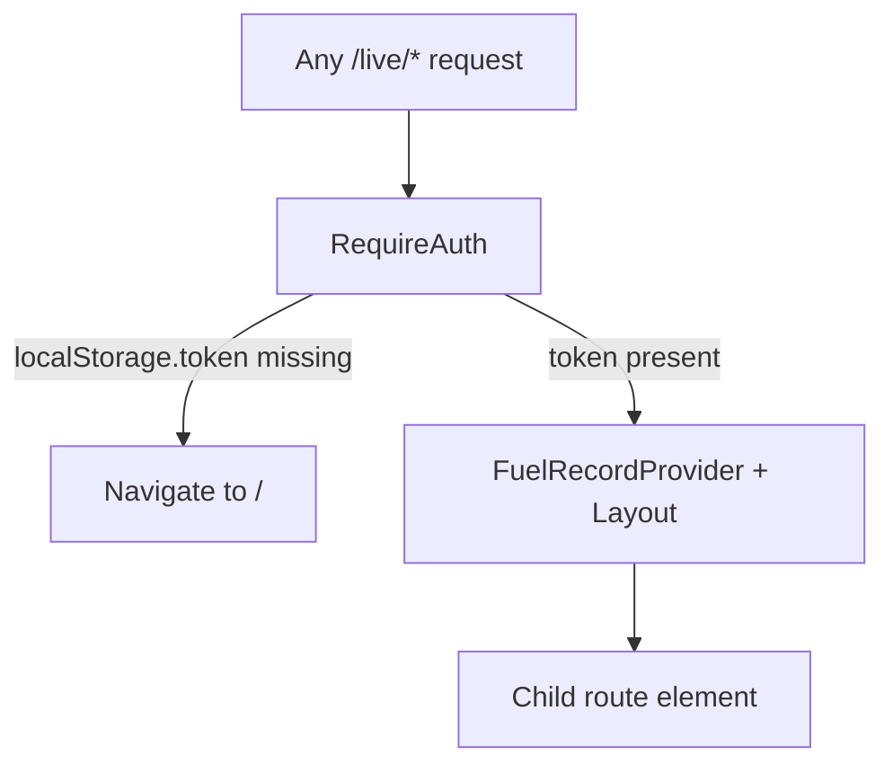
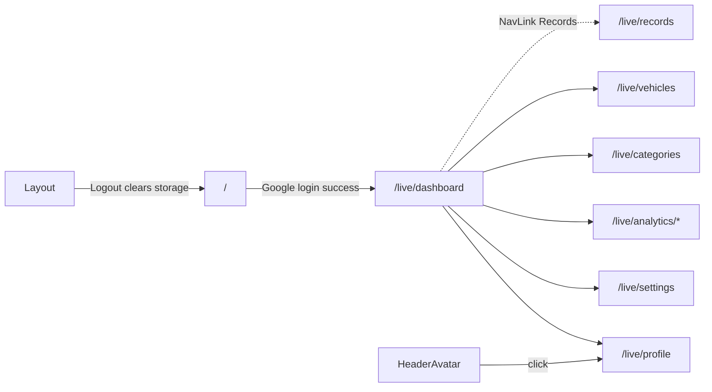

# 03 — Routing

Related: [Authentication](./04-authentication.md) · [Pages](./06-pages.md) · [Components — Layout](./07-components.md) · [AI context](./18-ai-context.md)

Routes are declared in [`src/App.tsx`](../src/App.tsx). Router is `BrowserRouter` from [`src/main.tsx`](../src/main.tsx).

## Route map

| Path | Component | Auth | Notes |
|------|-----------|------|-------|
| `/` | `Login` | Public | If `localStorage.token` exists, redirects to `/live/dashboard` |
| `/live` | `Layout` (outlet parent) | **Protected** via `RequireAuth` | Wraps children with `FuelRecordProvider` |
| `/live/dashboard` | `Dashboard` | Protected | Same component as records |
| `/live/records` | `Dashboard` | Protected | Primary nav label “Records” |
| `/live/settings` | `Settings` | Protected | |
| `/live/profile` | `Profile` | Protected | |
| `/live/vehicles` | `Vehicles` | Protected | |
| `/live/categories` | `Categories` | Protected | |
| `/live/serviceRecords` | `ServiceRecords` | Protected | **Stub** placeholder |
| `/live/analytics` | `Analytics` | Protected | **Stub** hub page |
| `/live/analytics/vehicleCategory` | `AnalyticsVehicleCategory` | Protected | Pie chart |
| `/live/analytics/fuelPrice` | `AnalyticsFuelPrice` | Protected | Area chart |
| `/live/analytics/vsChart` | `AnalyticsFuelType` | Protected | Fuel type pie (route name ≠ page name) |

## Protected vs public



- **Public:** `/` only
- **Protected:** everything under `/live` via `RequireAuth`
- Protection is **presence of `token` string in `localStorage` only** — no expiry check, no server session validation on navigation
- No role-based or permission-based route gates

### `RequireAuth` implementation

```tsx
function RequireAuth({ children }: { children: ReactElement }) {
  const token = typeof window !== 'undefined' ? localStorage.getItem('token') : null
  if (!token) return <Navigate to="/" replace />
  return children
}
```

## Nested routes

`/live` is a layout route. Child paths are **relative** (no leading slash in route defs):

```
/live
  ├── dashboard
  ├── records
  ├── settings
  ├── profile
  ├── vehicles
  ├── categories
  ├── serviceRecords
  ├── analytics
  ├── analytics/vehicleCategory
  ├── analytics/fuelPrice
  └── analytics/vsChart
```

`Layout` renders `<Outlet />` for the active child and shared chrome (header, sidebar, FAB, fuel form modal).

## Route parameters

**None.** There are no `:id` or query-param routes. Editing uses in-memory context / local state, not URL state.

## Navigation flow



### Sidebar links (`Layout`)

- Records → `/live/records`
- Analytics submenu → vehicleCategory / fuelPrice / vsChart
- Vehicles → `/live/vehicles`
- Categories → `/live/categories`
- Service Records → `/live/serviceRecords`
- Settings → `/live/settings`
- Profile → `/live/profile`
- Logout → client clear + `/`

### Naming quirks

| UI label | Path | Component file |
|----------|------|----------------|
| Records | `/live/records` (and `/live/dashboard`) | `Dashboard.tsx` |
| Fuel Type (analytics) | `/live/analytics/vsChart` | `AnalyticsFuelType.tsx` |

Default post-login destination is **`/live/dashboard`**, while the sidebar highlights **Records** at `/live/records`. Both render the same `Dashboard` component.

## Global overlays outside routes

`InstallPrompt` is rendered as a sibling of `<Routes>` in `App` — visible on all routes (including Login) when PWA install conditions are met.
