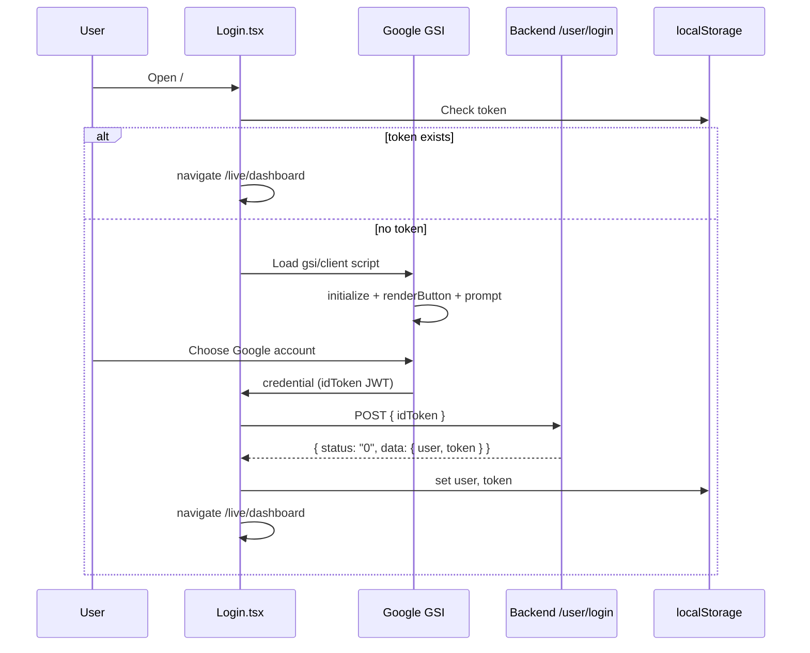
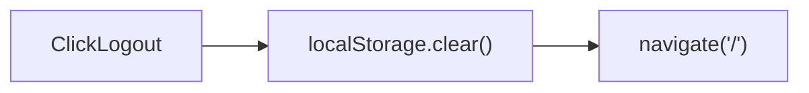

# 04 — Authentication

Related: [Routing](./03-routing.md) · [API](./05-api.md) · [Settings](./12-settings.md) · [Known risks](./16-known-risks.md)

## Summary

Authentication is **Google Sign-In (GIS)** + a backend session token stored in **`localStorage`**. There is no AuthProvider context, no refresh-token flow, and no axios response interceptor for 401 handling. Authorization on the client is all-or-nothing: logged in or not.

## Actors and secrets

| Item | Value / location |
|------|------------------|
| Google Client ID | Hardcoded in [`src/pages/Login.tsx`](../src/pages/Login.tsx) |
| Auth API base | `https://api.fuel.contactsunny.com/user` |
| Token storage key | `localStorage.token` |
| User storage key | `localStorage.user` (JSON string) |
| Auth header | Request header name: **`token`** (not `Authorization: Bearer`) |

## Login flow



### Steps in detail

1. On mount, if `localStorage.getItem('token')` is set → `navigate('/live/dashboard', { replace: true })`.
2. Dynamically inject `https://accounts.google.com/gsi/client`.
3. On script load: `google.accounts.id.initialize({ client_id, callback })`, render button into `#googleBtn`, call `prompt()` for One Tap.
4. Callback receives Google credential JWT as `response.credential`.
5. `axios.post` (raw axios, **not** the shared `api` instance) to `${AUTH_BASE}/login` with body `{ idToken }`.
6. Success condition: `data?.status === '0'` (**string** `"0"`).
7. Persist `data.data.user` and `data.data.token`, navigate to dashboard.
8. On failure: empty `catch` — **no user-visible error**.

## Logout flow

Implemented in [`Layout.tsx`](../src/components/Layout.tsx):

```ts
const logout = () => {
  localStorage.clear()
  navigate("/")
}
```



### Important gaps

- `endpoints.auth.logout` (`POST`/`DELETE` or similar under `/user/logout`) is **defined** in [`api.ts`](../src/services/api.ts) but **never called**.
- Logout clears **all** localStorage keys (including theme cache, PWA flags, cached avatar data URLs) — not only auth keys.

## Session management

| Concern | Behavior |
|---------|----------|
| Session start | Login success writes token + user |
| Session restore | Reload: `RequireAuth` checks token; Login redirects if token present |
| Session end | Logout clears storage; or manual deletion of token |
| TTL / expiry | **Not handled** in frontend |
| Token refresh | **None** |
| Concurrent tabs | Share same `localStorage` |

There is no periodic heartbeat and no validation that the token is still accepted by the API until a request fails.

## Token storage

- Key: `token`
- Sent on every `api` request via interceptor as header `token: <value>`
- Login uses standalone axios without that header (no token yet)

## Refresh tokens

**Not implemented.** No refresh endpoint usage, no silent re-auth.

## Protected routes

See [03-routing.md](./03-routing.md). Guard is client-side only.

## Permissions and authorization

- **No** roles, scopes, or permission checks in the frontend
- All authenticated users see the same nav and can call the same CRUD pages
- Backend is assumed to scope data to the token’s user

## Interceptors

**Request interceptor only** ([`src/services/api.ts`](../src/services/api.ts)):

```ts
api.interceptors.request.use((config) => {
  const token = localStorage.getItem('token')
  if (token) {
    config.headers = { ...headers, token }
  }
  return config
})
```

**No response interceptor** for:

- 401 → logout / redirect
- retries
- toast/error normalization

Pages handle errors per `catch` block with generic messages.

## Auth providers / middleware

| Pattern | Present? |
|---------|----------|
| React AuthContext / AuthProvider | No |
| Next.js middleware | N/A (Vite SPA) |
| Route middleware beyond `RequireAuth` | No |
| Server middleware | Backend only (out of repo) |

Theme and fuel-record contexts are unrelated to auth.

## localStorage keys touching auth / identity

| Key | Set by | Cleared by |
|-----|--------|------------|
| `token` | Login | Logout (`clear`) |
| `user` | Login | Logout |
| `user_image_<id|email>` | Layout / Profile image cache | Logout |
| `theme` | ThemeProvider | Logout (side effect) |
| `pwa-installed` | InstallPrompt | Logout (side effect) |

## Security notes for maintainers

- Google Client ID is public by design but is hardcoded; environment-based config would be safer for multi-environment deploys.
- Storing the API token in `localStorage` is XSS-sensitive.
- Success status check uses string `'0'` — treat as API convention, not a bug, unless backend docs say otherwise.
