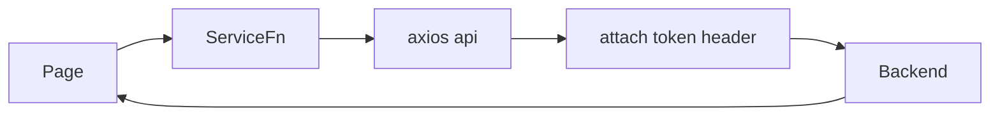

# 05 — API

Related: [Authentication](./04-authentication.md) · [Pages](./06-pages.md) · [Forms](./11-forms.md) · [Business rules](./13-business-rules.md)

## Base URL

```
https://api.fuel.contactsunny.com
```

Hardcoded in [`src/services/api.ts`](../src/services/api.ts) and again in [`preferences.ts`](../src/services/preferences.ts) and [`Login.tsx`](../src/pages/Login.tsx).

## Shared client behavior

| Concern | Behavior |
|---------|----------|
| Client | `axios.create()` exported as `api` |
| Auth | Request interceptor sets header `token` from `localStorage` |
| Caching | **None** (no HTTP cache layer / React Query) |
| Retries | **None** |
| Global error handling | **None** — callers `catch` individually |
| Response envelope | Usually `{ status, message?, error?, data }` — clients read `res.data?.data ?? res.data` |
| List shapes | Array **or** `{ items: [] }` — many parsers accept both |
| Date query format | `yyyyMMddHHmmss` — start uses `000000`, end uses `235959` |

### Date query helper (duplicated)

Used in `fuel.ts`, `serviceRecords.ts`, `analytics.ts`:

```
20250114000000  // start of day
20250114235959  // end of day
```

Built from local `Date` getters (browser timezone).



---

## Auth

### POST `/user/login`

| Field | Detail |
|-------|--------|
| Purpose | Exchange Google ID token for app session |
| Method | `POST` |
| URL | `https://api.fuel.contactsunny.com/user/login` |
| Auth | None |
| Request | `{ idToken: string }` |
| Response (success) | `{ status: "0", data: { user: object, token: string } }` |
| Called from | `Login.tsx` via raw `axios` (not `api`) |
| Caching / retries | None |
| Error handling | Empty catch — silent failure |

### `/user/logout`

| Field | Detail |
|-------|--------|
| Purpose | Declared in `endpoints.auth.logout` |
| Used? | **No** — logout is client-only |

---

## Fuel records

Base: `https://api.fuel.contactsunny.com/fuel`

### GET `/fuel`

| Field | Detail |
|-------|--------|
| Purpose | List user's fuel records in a date range |
| Method | `GET` |
| Query | `startDate`, `endDate` (compact datetime strings) |
| Auth | `token` header |
| Response | Envelope with array or `{ items }` of fuel records |
| Service | `getUserFuel` in [`fuel.ts`](../src/services/fuel.ts) |
| Used by | `Dashboard` (Records) |

Inferred record fields (from UI parsers / form payload):  
`id`/`_id`, `date`/`createdAt`, `vehicleId`, `vehicle`/`vehicleName`, `vehicleCategoryId`/`categoryId`, `fuelType`/`type`, `paymentType`, `litres`/`liters`/`volume`/`quantity`, `amount`/`price`/`cost`, `costPerLitre`.

Exact OpenAPI schema: **cannot be determined** from this repo alone.

### POST `/fuel`

| Field | Detail |
|-------|--------|
| Purpose | Create fuel record |
| Method | `POST` |
| Auth | `token` |
| Payload (from form) | `{ vehicleId, amount, date (ISO), costPerLitre (string), paymentType, litres, fuelType }` |
| Service | `createFuel` |
| Used by | `FuelRecordForm` (create mode) |

### PUT `/fuel/{id}`

| Field | Detail |
|-------|--------|
| Purpose | Update fuel record |
| Method | `PUT` |
| Auth | `token` |
| Payload | Same shape as create |
| Service | `updateFuel` |
| Used by | `FuelRecordForm` (edit mode) |

### DELETE `/fuel/{id}`

| Field | Detail |
|-------|--------|
| Purpose | Delete fuel record |
| Method | `DELETE` |
| Auth | `token` |
| Service | `deleteFuel` |
| Used by | `Dashboard` confirm-delete dialog |

---

## Vehicles

Base: `https://api.fuel.contactsunny.com/vehicle`

### GET `/vehicle`

| Field | Detail |
|-------|--------|
| Purpose | List user vehicles |
| Method | `GET` |
| Auth | `token` |
| Service | `getUserVehicles` |
| Used by | Dashboard, Vehicles, Settings, FuelRecordForm |

Inferred fields: `id`/`_id`/`vehicleId`, `name`/`vehicleName`, `categoryId`/`vehicleCategoryId`, `vehicleNumber`, nested `category`.

### POST `/vehicle`

| Payload (from form) | `{ name, categoryId?, vehicleCategoryId?, vehicleNumber? }` |
| Service | `createVehicle` |
| Used by | `VehicleForm` |

### PUT `/vehicle/{id}`

| Service | `updateVehicle` |
| Used by | `VehicleForm` |

### DELETE `/vehicle/{id}`

| Service | `deleteVehicle` |
| Used by | `Vehicles` page |

---

## Vehicle categories

Base: `https://api.fuel.contactsunny.com/vehicleCategory`

### GET `/vehicleCategory`

| Service | `getUserVehicleCategories` |
| Used by | Dashboard, Vehicles, Categories, VehicleForm |

Inferred fields: `id`/`_id`/`categoryId`, `name`/`title`/`categoryName`, `description`.

### POST `/vehicleCategory`

| Payload | `{ name, description? }` |
| Service | `createVehicleCategory` |
| Used by | `CategoryForm` |

### PUT `/vehicleCategory/{id}`

| Service | `updateVehicleCategory` |
| Used by | `CategoryForm` |

### DELETE `/vehicleCategory/{id}`

| Service | `deleteVehicleCategory` |
| Used by | `Categories` page |

---

## Preferences

Base path hardcoded separately: `https://api.fuel.contactsunny.com/preferences`

### GET `/preferences`

| Purpose | Load user defaults |
| Auth | `token` |
| Response | Object with `defaultVehicleId`, `defaultFuelType`, `defaultPaymentType` (via `data.data` or `data`) |
| Service | `getPreferences` |
| Used by | `Settings`, `Layout` (for fuel form defaults) |

### POST `/preferences`

| Purpose | Save defaults |
| Auth | `token` |
| Payload | `{ defaultVehicleId?, defaultFuelType?, defaultPaymentType? }` |
| Service | `savePreferences` |
| Used by | `Settings` (on each dropdown change) |

---

## Analytics

Base: `https://api.fuel.contactsunny.com/analytics`  
All require `token` and `startDate`/`endDate` query params. Chart pages use fixed last-6-months window.

### GET `/analytics/vehicleCategory`

| Response `data` | `[{ vehicleCategoryId, vehicleCategoryName, total }]` |
| Service | `getCategoryAnalytics` |
| Used by | `AnalyticsVehicleCategory` |

### GET `/analytics/fuelPrice`

| Response `data` | `{ PETROL: [...], DIESEL: [...] }` with points containing `date`/`day`, `month`, `year`, `cost`/`price`/`value`/`amount` |
| Service | `getFuelPriceAnalytics` |
| Used by | `AnalyticsFuelPrice` |

### GET `/analytics/fuelType`

| Response `data` | `[{ year, month, petrolCost, dieselCost }]` |
| Service | `getFuelTypeAnalytics` |
| Used by | `AnalyticsFuelType` |

---

## Service records (API ready, UI unused)

Base: `https://api.fuel.contactsunny.com/serviceRecord`

| Method | Path | Service fn | Used by UI? |
|--------|------|------------|-------------|
| GET | `/serviceRecord?startDate&endDate` | `getServiceRecords` | **No** |
| POST | `/serviceRecord` | `createServiceRecord` | **No** |
| PUT | `/serviceRecord/{id}` | `updateServiceRecord` | **No** |
| DELETE | `/serviceRecord/{id}` | `deleteServiceRecord` | **No** |

Payload/response shapes for create/update: **cannot be determined** — no form constructs them yet.

---

## Authentication requirements matrix

| Endpoint group | Requires `token` header |
|----------------|-------------------------|
| `POST /user/login` | No |
| All other documented endpoints | Yes (via interceptor when using `api`) |

---

## Error handling conventions in callers

Typical pattern:

```ts
.catch(() => setError('Failed to load …'))
// or
catch (err) {
  setError(err.response?.data?.message || err.response?.data?.error || err.message || '…')
}
```

HTTP status codes are not mapped centrally.
