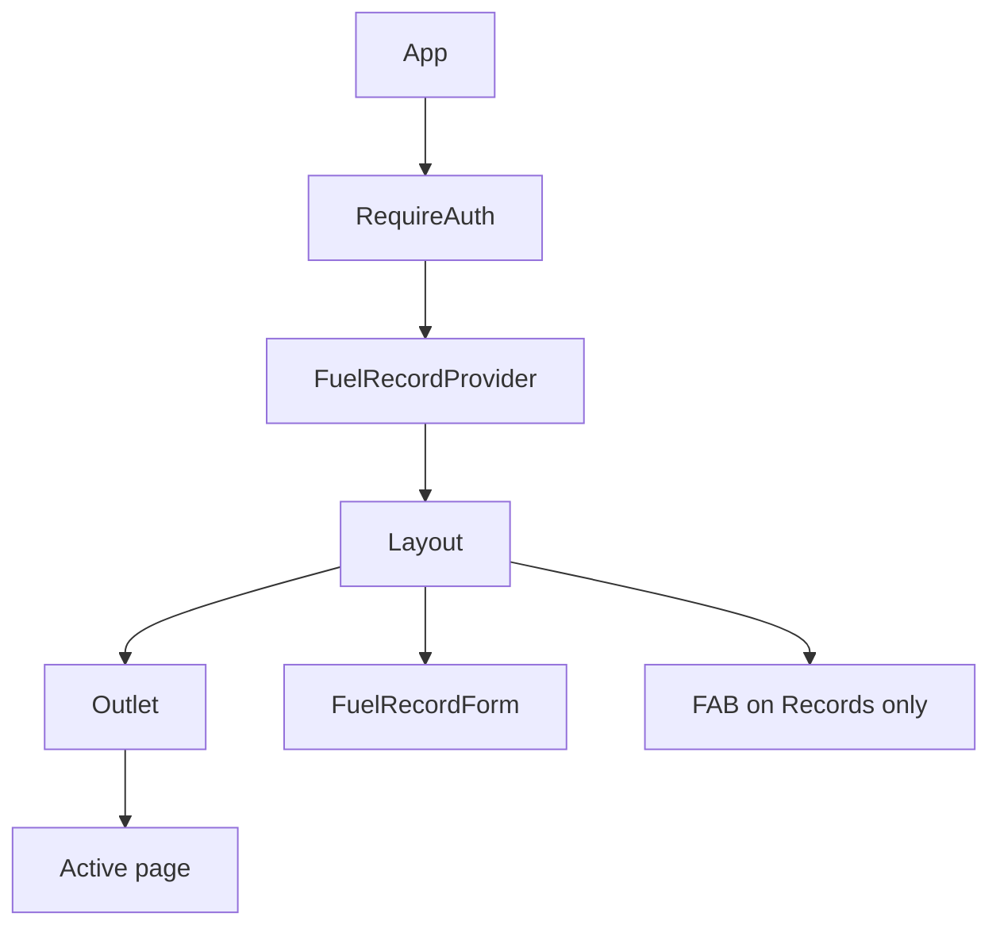

# 06 — Pages

Related: [Routing](./03-routing.md) · [API](./05-api.md) · [Forms](./11-forms.md) · [Tables](./10-tables.md) · [Components](./07-components.md)

## Component hierarchy (authenticated)

---

## Login

| Field | Detail |
|-------|--------|
| File | [`src/pages/Login.tsx`](../src/pages/Login.tsx) |
| Route | `/` |
| Purpose | Google Sign-In gate |
| Components used | Inline card UI; Google button into `#googleBtn` |
| API calls | `POST /user/login` (raw axios) |
| State | None beyond effects / navigate |
| Forms | None |
| Permissions | Public |
| Loading | Google script async load |
| Error states | Silent catch on login failure |
| Redirects | Token present → `/live/dashboard` |

---

## Dashboard / Records

| Field | Detail |
|-------|--------|
| File | [`src/pages/Dashboard.tsx`](../src/pages/Dashboard.tsx) |
| Routes | `/live/dashboard`, `/live/records` |
| Purpose | List fuel records with summary chips, filters, pagination, edit/delete |
| Components | `DateRangePicker`; edit/delete rely on `FuelRecordForm` in Layout via context |
| API | `getUserFuel`, `getUserVehicles`, `getUserVehicleCategories`, `deleteFuel` |
| State | Local: rows, filters, pagination, modals; Context: edit form + `refreshTrigger` |
| Interactions | Filters modal; edit opens fuel form; delete confirmation |
| Forms | Filter selects + date range (not a submit form) |
| Tables | Desktop table / mobile cards — see [10-tables.md](./10-tables.md) |
| Filters | Date range (server), vehicle, category, fuel type, payment type (client) |
| Search | **None** |
| Pagination | Client-side; 10/25/50/100 |
| Dialogs | Filters modal; delete confirm |
| Permissions | Authenticated only |
| Loading | “Loading…” |
| Error | Red message string |
| Derived | `totalAmount`, `totalLitres` for filtered set |

Default date range: **6 months ago → today**.

FAB for add-record lives in `Layout`, visible only on these routes.

---

## Vehicles

| Field | Detail |
|-------|--------|
| File | [`src/pages/Vehicles.tsx`](../src/pages/Vehicles.tsx) |
| Route | `/live/vehicles` |
| Purpose | CRUD list of vehicles |
| Components | `VehicleForm` |
| API | `getUserVehicles`, `getUserVehicleCategories`, `deleteVehicle` (+ form create/update) |
| State | Local rows, form open, editing entity, delete confirm, `refreshTrigger` |
| Tables | Name, Category, Registration, Actions |
| Filters / search / pagination | **None** |
| Dialogs | Form modal; delete confirm |
| FAB | Add vehicle |
| Loading / error | Standard |

---

## Categories

| Field | Detail |
|-------|--------|
| File | [`src/pages/Categories.tsx`](../src/pages/Categories.tsx) |
| Route | `/live/categories` |
| Purpose | CRUD list of vehicle categories |
| Components | `CategoryForm` |
| API | `getUserVehicleCategories`, `deleteVehicleCategory` (+ form) |
| Tables | Dynamic columns from first row (prefer name + description) |
| Filters / search / pagination | **None** |
| FAB | Add category |

---

## Service Records

| Field | Detail |
|-------|--------|
| File | [`src/pages/ServiceRecords.tsx`](../src/pages/ServiceRecords.tsx) |
| Route | `/live/serviceRecords` |
| Purpose | Placeholder only |
| API | **None wired** |
| UI | Title + “Service records table will appear here.” |

---

## Settings

| Field | Detail |
|-------|--------|
| File | [`src/pages/Settings.tsx`](../src/pages/Settings.tsx) |
| Route | `/live/settings` |
| Purpose | Save default vehicle, fuel type, payment method |
| API | `getUserVehicles`, `getPreferences`, `savePreferences` |
| Forms | Three selects; auto-save on change (optimistic with revert) |
| Tables | None |
| Loading / error / saving | Yes |

See [12-settings.md](./12-settings.md).

---

## Profile

| Field | Detail |
|-------|--------|
| File | [`src/pages/Profile.tsx`](../src/pages/Profile.tsx) |
| Route | `/live/profile` |
| Purpose | Display name, email, avatar from `localStorage.user` |
| API | **None** |
| State | Avatar URL + initials fallback + Google CDN retry |
| Forms / tables | None |

Duplicated avatar helpers also exist in `Layout`.

---

## Analytics (hub)

| Field | Detail |
|-------|--------|
| File | [`src/pages/Analytics/Analytics.tsx`](../src/pages/Analytics/Analytics.tsx) |
| Route | `/live/analytics` |
| Purpose | Stub: “Choose an analytics view from the sidebar.” |
| API | None |

---

## Analytics — Vehicle Category

| Field | Detail |
|-------|--------|
| File | `AnalyticsVehicleCategory.tsx` |
| Route | `/live/analytics/vehicleCategory` |
| Purpose | Donut/pie of spend by category (6 months) |
| API | `getCategoryAnalytics` |
| Charts | Recharts `PieChart` |
| Filters | Hardcoded 6-month range; no UI filter |

---

## Analytics — Fuel Price

| Field | Detail |
|-------|--------|
| File | `AnalyticsFuelPrice.tsx` |
| Route | `/live/analytics/fuelPrice` |
| Purpose | Area chart of petrol/diesel unit cost over time |
| API | `getFuelPriceAnalytics` |
| Charts | Recharts `AreaChart` |
| Filters | Hardcoded 6 months |

---

## Analytics — Fuel Type

| Field | Detail |
|-------|--------|
| File | `AnalyticsFuelType.tsx` |
| Route | `/live/analytics/vsChart` |
| Purpose | Pie of total petrol vs diesel spend (aggregated) |
| API | `getFuelTypeAnalytics` |
| Charts | Recharts `PieChart` |
| Notes | Route name `vsChart` is historical / misleading |

---

## Shared page patterns

1. `screenWidth < 768` → mobile card list vs desktop table (Records, Vehicles, Categories).
2. Loading / error / empty ternary blocks.
3. Delete = confirm modal then API then refresh counter.
4. Modal forms for create/edit.
5. Heavy use of `any` and defensive field aliases (`id` vs `_id`, `litres` vs `liters`, etc.).
