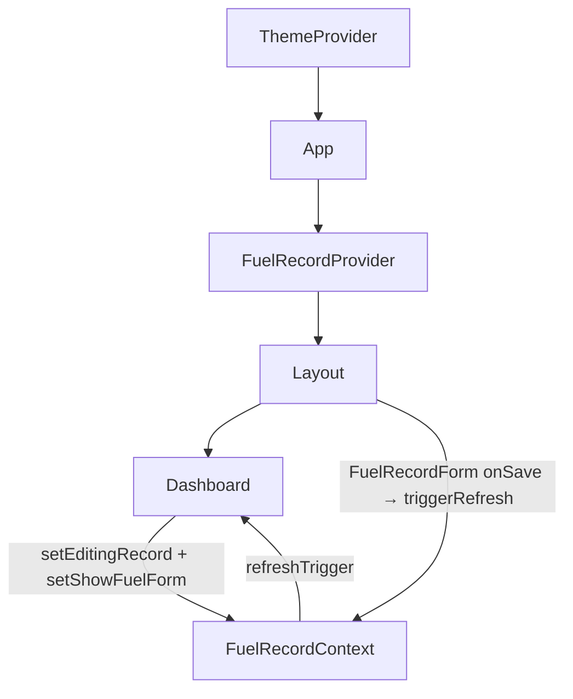
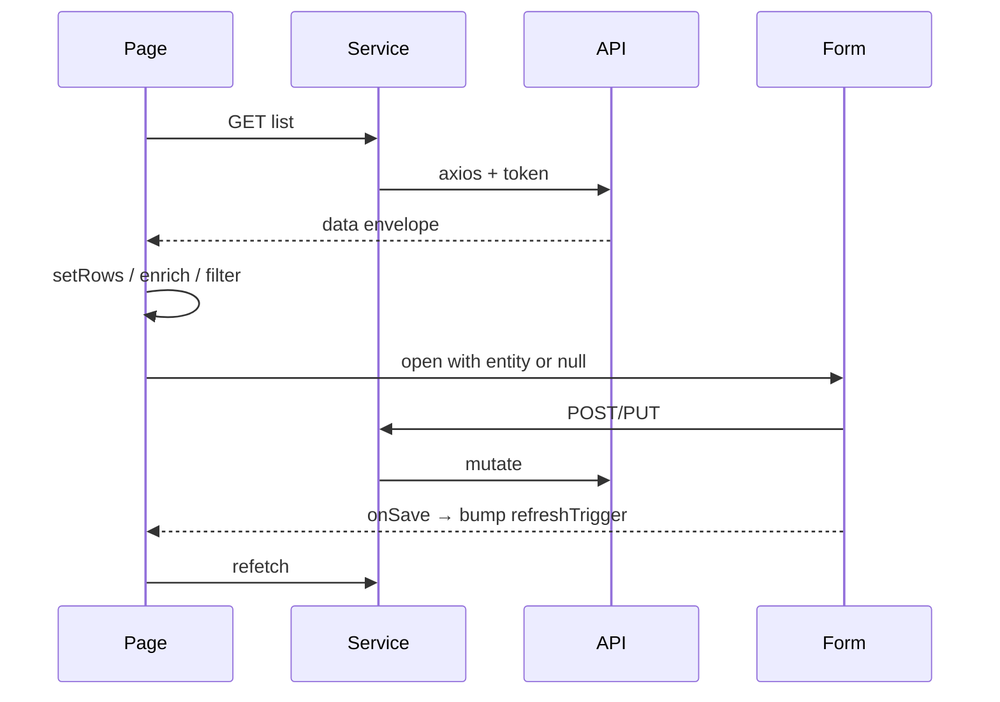

# 08 — State Management

Related: [Components](./07-components.md) · [Pages](./06-pages.md) · [Authentication](./04-authentication.md) · [AI context](./18-ai-context.md)

## Stack reality check

| Library | Used? |
|---------|-------|
| React Context | **Yes** — Theme, FuelRecord |
| Redux | No |
| Zustand | No |
| MobX | No |
| React Query / TanStack Query | No |
| Global store (custom) | No |
| URL search params as state | No |

## Contexts

### ThemeContext

- File: [`src/contexts/ThemeContext.tsx`](../src/contexts/ThemeContext.tsx)
- Mounted in `main.tsx` wrapping entire app
- Preference: `theme: 'dark' | 'light' | 'system'` (default **`system`** if unset)
- Resolved theme: `resolvedTheme: 'dark' | 'light'` from preference + `prefers-color-scheme`
- Persistence: `localStorage.theme`
- Side effect: toggles `.dark` on `document.documentElement`; updates theme-color meta
- Listens to OS scheme changes when preference is `system`
- API: `{ theme, resolvedTheme, setTheme, toggleTheme }` via `useTheme()`
- `toggleTheme` cycles light → dark → system

### FuelRecordContext

- File: [`src/contexts/FuelRecordContext.tsx`](../src/contexts/FuelRecordContext.tsx)
- Mounted only under authenticated `/live` tree in `App.tsx`
- State:
  - `editingRecord` — record being edited or `null`
  - `showFuelForm` — modal visibility
  - `refreshTrigger` — number bumped to force Dashboard refetch
  - `triggerRefresh()`, setters
- Consumers: `Layout` (owns modal), `Dashboard` (edit + refresh)

## Local component state

Dominant pattern. Examples:

- List pages: `rows`, `loading`, `error`, `refreshTrigger`, delete dialog state
- Dashboard: filters, pagination, date range
- Settings: dropdown values + saving
- Analytics: chart data arrays
- Forms: `formData`, `saving`, `error`

## “Global” state that is not React state

| Store | Keys / data |
|-------|-------------|
| `localStorage` | `token`, `user`, `theme`, `user_image_*`, `pwa-installed` |
| `sessionStorage` | `pwa-prompt-dismissed` |

Auth and profile display rely on localStorage, not Context.

## Derived state

Computed with `useMemo` or inline:

- Dashboard: filtered `rows`, unique fuel/payment types, totals, pagination slice
- Categories: dynamic `columns` from first row
- AnalyticsFuelType: aggregated petrol/diesel totals → pie slices
- FuelRecordForm: `costPerLitre` from amount / volume

## Data flow (typical feature)

## Mental model for contributors

1. Prefer **local state** on the page that owns the data.
2. Use **FuelRecordContext** only for coordinating the shared fuel modal with Layout.
3. Use **ThemeContext** only for theme.
4. Do not introduce a second global pattern without updating this doc and [18-ai-context.md](./18-ai-context.md).
