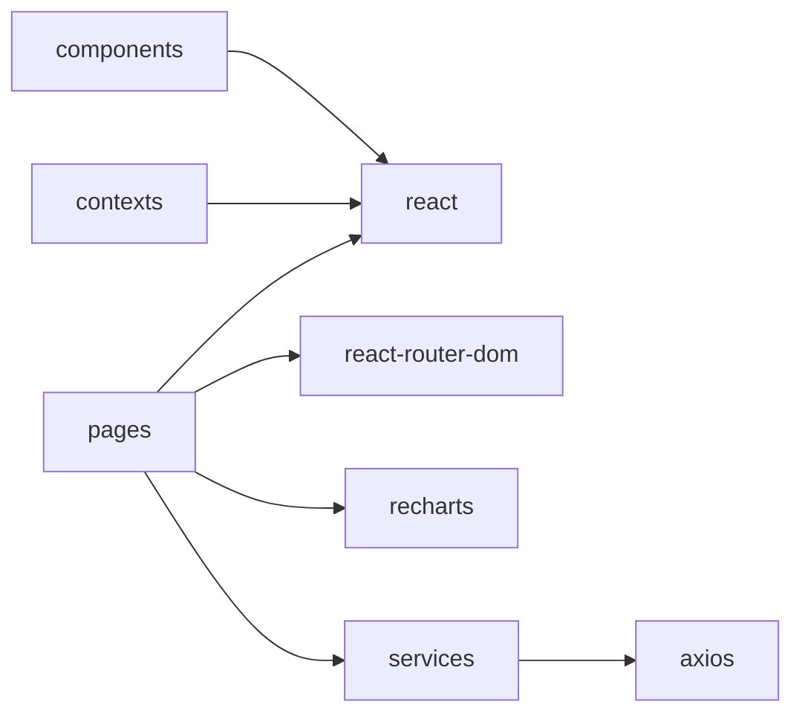

# 14 — Dependencies

Related: [Overview](./01-overview.md) · [Improvement opportunities](./15-improvement-opportunities.md)

Source: [`package.json`](../package.json).

## Runtime dependencies (core)

| Package | Why it exists | Where used | Core? |
|---------|---------------|------------|-------|
| `react` / `react-dom` | UI framework | Entire app | **Core** |
| `react-router-dom` | Client routing, NavLink, Outlet | `main.tsx`, `App.tsx`, `Layout` | **Core** |
| `axios` | HTTP client | `services/*`, Login | **Core** |
| `lucide-react` | Consistent icon set | Layout, pages, forms, InstallPrompt | **Core** for UI |
| `recharts` | Charts | Analytics pages | **Core** for analytics features |
| `date-fns` | Declared for date utilities | **Not imported anywhere** | Unused / optional candidate |
| `@fontsource-variable/inter` | Inter Variable font | `main.tsx` | **Core** for typography |

## Dev dependencies

| Package | Role | Core to build? |
|---------|------|----------------|
| `vite` | Bundler / dev server | **Yes** |
| `@vitejs/plugin-react` | React Fast Refresh | **Yes** |
| `typescript` | Types / `tsc -b` in build | **Yes** |
| `vite-plugin-pwa` | Service worker + manifest | **Yes** for PWA |
| `tailwindcss` + `@tailwindcss/postcss` | Styling | **Yes** |
| `postcss` / `autoprefixer` | CSS pipeline | **Yes** |
| `eslint` + plugins | Lint | Dev quality |
| `sharp` | Icon generation script | Optional tooling |
| `@types/*` | TS types | Dev |

Workbox packages are pulled transitively through `vite-plugin-pwa` / used in `sw.ts` (`workbox-precaching`).

## Import boundary map

## Notes

- Prefer extending existing **core** libraries before adding new state/form/UI frameworks (see [18-ai-context.md](./18-ai-context.md)).
- If introducing date utilities, either use `date-fns` (already installed) or remove it to avoid dead dependency noise.
