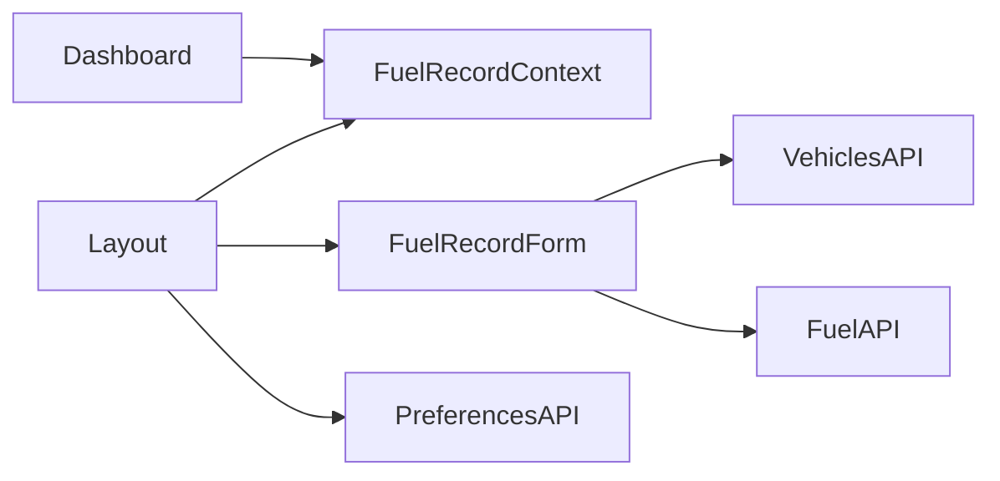

# 16 — Known Risks

Related: [Improvement opportunities](./15-improvement-opportunities.md) · [Authentication](./04-authentication.md) · [AI context](./18-ai-context.md)

## Fragile areas

| Area | Why fragile |
|------|-------------|
| Google Sign-In script load + GIS callbacks | External dependency; DOM script injection; silent errors |
| Token-only `RequireAuth` | Expired/invalid tokens still enter the app; APIs fail later |
| Response shape parsers | Many fallbacks; a backend breaking change may empty lists quietly |
| Dashboard data effect deps | Tied to vehicles/categories/refresh — easy to cause loops or missed updates |
| Fuel form in Layout | Cross-cutting coupling; Record page must stay in sync with context contract |
| PWA `sw.ts` | Precache + skipWaiting; bad edits can brick installs or stale assets |

## Tightly coupled modules

- Changing FuelRecordContext shape requires Layout + Dashboard together
- Preferences load path assumes Layout owns fuel form defaults

## Legacy / inconsistent code

- Dual routes `dashboard` and `records` → same page
- Analytics route `vsChart` vs component `AnalyticsFuelType`
- Dual ID conventions (`id` / `_id`) retained everywhere — suggests mixed Mongo/SQL or evolving API
- Vite template leftovers (`App.css`, default README)

## Assumptions future developers should not casually break

1. **Header name is `token`, not Bearer** — changing interceptor breaks all authenticated calls.
2. **Login success is string `"0"`** — treating as number `0` breaks login.
3. **Date query format `yyyyMMddHHmmss`** — wrong length/format fails list/analytics silently.
4. **Cost per litre is a string in fuel payload** — backend may type-check.
5. **Both `categoryId` and `vehicleCategoryId` on vehicles** — removing one may break persistence.
6. **Hardcoded production API host** — pointing elsewhere requires multi-file edits today.
7. **Google Client ID** — changing without Console update breaks all auth.
8. **`FuelRecordProvider` must wrap `Layout`** — using `useFuelRecord` outside throws.

## Things to avoid changing casually

| Path | Risk |
|------|------|
| `src/services/api.ts` | Global auth + all endpoints |
| `src/pages/Login.tsx` Client ID / status check | Total lockout |
| `src/sw.ts` / PWA config | Offline/update breakage |
| Enum string values for fuel/payment | Data incompatibility with backend + preferences |
| `localStorage` key names `token` / `user` | Session restore fails |

## Security assumptions

- Backend validates the Google `idToken` and scopes records to the user
- Frontend does not sanitize HTML beyond React defaults; user-provided names rendered as text (safe-ish) but trust the API data
- XSS against the origin can steal `localStorage.token`

## Incomplete features as landmines

- Clicking Service Records looks like a feature; implement or hide
- Declared logout endpoint may leave server sessions alive after client logout
